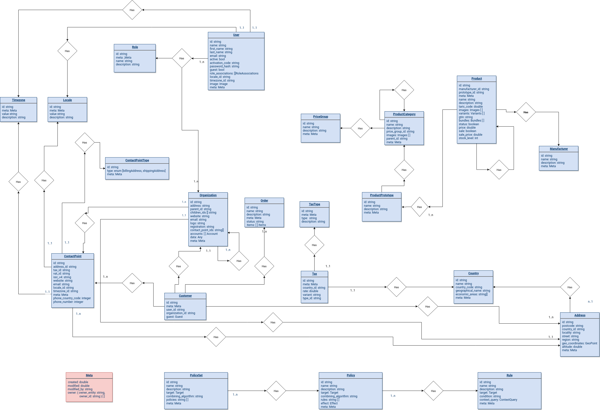

# Data Model

In a micro services system, each service has its own domain model, it
is however useful to the entities in the context of all services thus showing
the logical interconnections between the services:

## Changing

Edit the model by importing the XML-file to [https://www.draw.io/](https://www.draw.io/).
